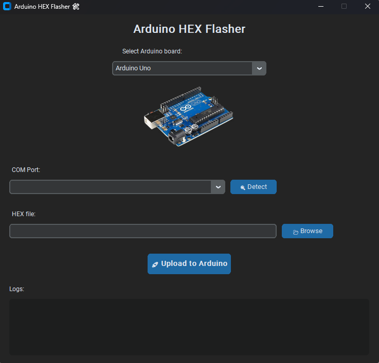

# Arduino-HEX-Flasher
Arduino HEX Flasher - GUI tool to upload HEX files to Arduino boards (Uno, Nano, Leonardo, Pro Micro, Mega) using avrdude.

# Arduino HEX Flasher – Universal Firmware Uploader for Windows

A modern, user-friendly Windows application to easily flash `.hex` firmware files onto various Arduino boards — **without Arduino IDE**.

Built with Python and CustomTkinter, this tool detects your board automatically, handles bootloader quirks, and uses the reliable `avrdude` under the hood — all in a sleek, dark-themed GUI.

  

---

## ✅ Supported Boards

- **Arduino Uno**
- **Arduino Nano** (auto-detects old vs. new bootloader)
- **Arduino Leonardo**
- **Arduino Pro Micro**
- **Arduino Mega 2560**

The app intelligently selects the correct MCU, baud rate, and programmer settings for each board — no manual configuration needed!

---

## 🔧 Key Features

- **One-click upload** — just select your `.hex` file and go  
- **Automatic port detection** — recognizes CH340, FT232, and official Arduino chips  
- **Smart Nano bootloader detection** — tries old (57600 baud) and new (115200 baud) automatically  
- **Leonardo/Pro Micro support** — triggers 1200-baud auto-reset  
- **Portable** — includes `avrdude.exe` and `avrdude.conf` in the same folder  
- **No Arduino IDE required**  
- **Modern, dark-themed GUI** with board preview images  
- **Fully offline** — works without internet  

---

## 🖥️ Requirements

- Windows 7 or newer
- USB driver installed for your board

> 💡 **Note**: This is a **Windows-only** application (`.exe`), built with PyInstaller.

---

## 🚀 How to Use

1. Download the latest release (`.exe` + assets)
2. Connect your Arduino board via USB
3. Launch **Arduino HEX Flasher.exe**
4. Select your board from the dropdown
5. Click **"Detect"** to find the COM port
6. Choose your `.hex` file
7. Click **"Upload"** — and you're done!

---

## 🛠️ Build from Source

1. Install Python 3.8+
2. Install dependencies:
   ```bash
   pip install -r requirements.txt
